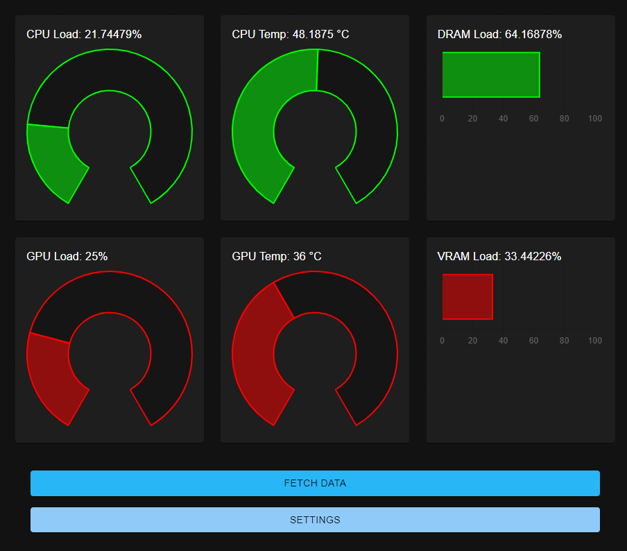
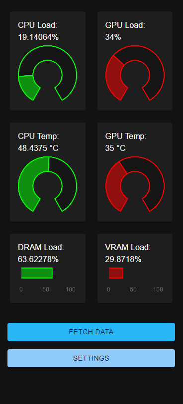

# PC Watcher Application

## Preview:
 

*NOTE: image out of date, needs to be replaced*

## Function
Utilizes React and Java to create an elegant application to monitor the load, temperature, and memory usage of a PC's CPU and GPU. Can either be run entirely on the PC you wish to monitor, or the Java portion can be run on the PC, and the React portion can be run on a server within the same network.

## Installation
You can install either only the executables or the entire project, depending on whether your intended use is to simply run the program or to utilize it for adaptation as a remote monitoring server.

To download only the executables, you can: 
- Download the "PC Watcher" folder as a ZIP and unpack it to your desired location

To download the full project, you can do one of the following: 
- Download the ZIP file and extracted into your desired location
- Navigating to your desired location in Terminal and using `git clone https://github.com/ABCaps35/pcwatcher.git`

## Execution
The files in the "PC Watcher" folder are designed for one-step execution of the React front-end and Java back-end separately. 

To run the application fully on one computer (for local use):
1. Navigate to the "PC Watcher" folder if you haven't already.
2. Open up a Terminal window at the "PC Watcher" folder and run `java -jar pc-watcher-0.0.1-SNAPSHOT.war` to start the Java backend.
3. Run "pcwatcher Setup.exe" to install and launch the pcwatcher application.

To run the application between two separate machines (best for adapting to remote/server use):
1. Install the package to your desired location on the machine you wish to monitor
2. Locate the "PC Watcher" folder within the package
3. Locate the file pc-watcher-0.0.1-SNAPSHOT.war and move it to your desired location
4. Run `java -jar pc-watcher-0.0.1-SNAPSHOT.war` at your desired location to start Java back-end
5. Copy the "pcwatcher " to the machine on which you want to run your React application
6. In a Terminal window on this second machine, navigate to the src/main/ui folder
7. run `npm run start` to get React application running

Note: After running the "pcwatcher Setup.exe", PCWatcher will be installed on your device, and you can launch it at any time from the Start menu, but will not receive data without the Java executable also running.

## Tools Used
### Main Technologies
- React.js
- Spring Boot

### Packages
- jSensors (https://github.com/profesorfalken/jSensors)
- OSHI (https://github.com/oshi/oshi)
- Material-UI (https://mui.com/)
- react-chartjs-2 (https://github.com/reactchartjs/react-chartjs-2)

### Other Dependency Notes
Open Hardware Monitor (https://openhardwaremonitor.org/) should be running concurrently to ensure that CPU temperatures are collected correctly

## Future Plans
The following items are to be worked on in the future:
- Linux, Mac builds
- Adaptation for external server monitoring
- Potential migration to C# backend for faster, simpler Windows architecture