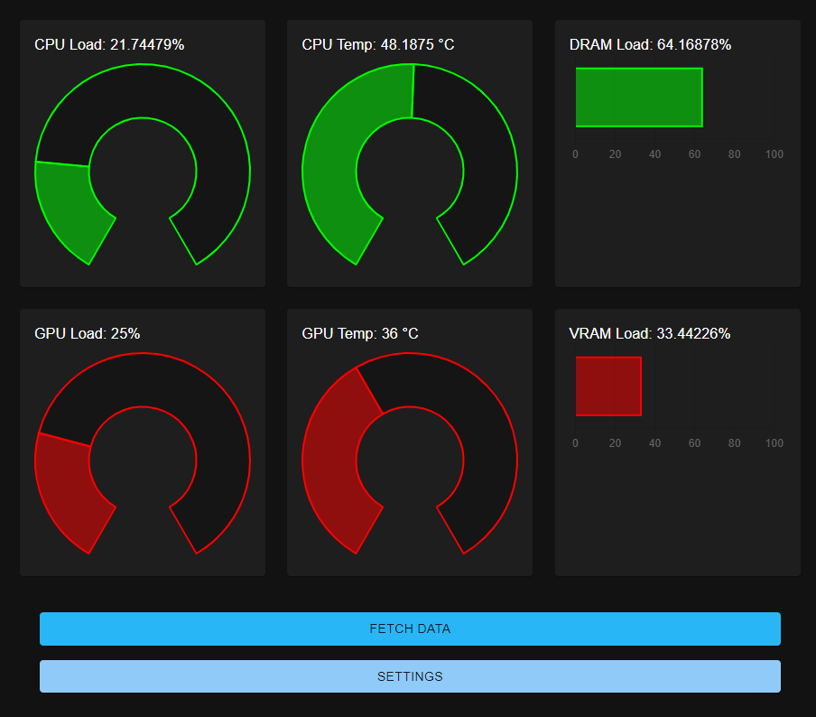
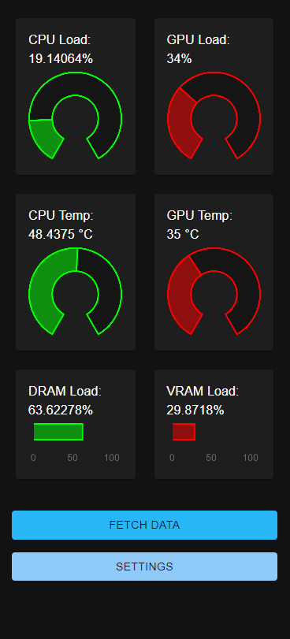

# PC Watcher Application

## Preview:
 

*NOTE: image out of date, needs to be replaced*

## Function
Utilizes React and Java to create an elegant application to monitor the load, temperature, and memory usage of a PC's CPU and GPU

## Installation
Currently the project folder must be downloaded

## Execution
Currently the .war file in the src/target folder and the React app in the src/main/ui folder must be run separately, but a one-step installation is in the works.

## Tools Used
### Main Technologies
- React.js
- Spring Boot

### Packages
- jSensors (https://github.com/profesorfalken/jSensors)
- OSHI (https://github.com/oshi/oshi)
- Material-UI (https://mui.com/)
- react-chartjs-2 (https://github.com/reactchartjs/react-chartjs-2)

### Other Dependency Notes
Open Hardware Monitor (https://openhardwaremonitor.org/) should be running concurrently to ensure that CPU temperatures are collected correctly

## Future Plans
The following items are to be worked on in the future:
- One-step installation 
- One-step execution (possibly including a .jar file or Electron wrapping)
- Adaptation for external server monitoring
- Potential migration to C# backend for faster, simpler Windows architecture